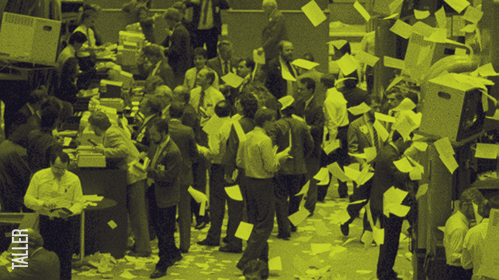

  
**¿Qué \#\!%&$ es el neoliberalismo? (2022)**

Neoliberalismo es uno entre tantos conceptos que habitan el lenguaje común de nuestras sociedades pero qué, al mismo tiempo, parecen resistirse a señalar algo específico. Algunos usan la palabra para nombrar un “modelo económico” que es fuente de malestares globales: pobreza, exclusión, desigualdad, precariedad, etc; otros, en cambio, acusan al término de ser una simple caricatura discursiva de la izquierda para deslegitimar las “exitosas” políticas económicas de la actualidad. El resultado de esta lucha es que la vigencia de la palabra es inversamente proporcional a su claridad. Pero, ¿qué \#\!%&$ es el neoliberalismo?

Presentamos este taller para abordar dicha pregunta en toda su complejidad, recuperando tanto los aciertos de esta denominación como sus límites en cuanto a las prácticas que designa. Nuestro objetivo es llegar a una comprensión adecuada del término que nos permita reflexionar sobre la actualidad sin perdernos en sus discusiones más pantanosas.

En tres sesiones de dos horas y media trabajaremos sobre algunas preguntas que se desprenden de la disputa actual por la palabra: ¿Nos sirve de algo seguir usándola? ¿Existe algo así como una genealogía de dicho “modelo”? y, finalmente, ¿Qué lugar tenemos las y los individuos en producción y reproducción de sus prácticas y discursos? Para ello revisaremos diversas historias y teorías elaboradas para explicar el accionar del “neoliberalismo” desde sus actores e instituciones; y estudiaremos enfoques teóricos que amplían el entendimiento del mismo como “modelo económico” hacia una visión más heterogénea sobre sus mandatos y códigos culturales.

El curso está dirigido a cualquier persona interesada en el tema, sin que sea necesario tener algún tipo de conocimiento previo en economía o historia de la misma. Se compartirán algunas lecturas complementarias y otros referentes escritos.

El taller será conducido por Carlos Zevallos Trigoso, Magíster en Antropología Visual, Comunicador y docente en la Pontificia Universidad Católica del Perú.  

**Duración**: tres sesiones de 7:00 a 9:30pm  
**Fechas:** 13, 20 y 27 de abril (miércoles)  
**Costo:** S/. 160 (pago vía transferencia, Yape o Plin)  
Vía: Zoom

**Programa**

* 13 de abril: ¿Todavía sirve esa palabra? Vigencia del neoliberalismo como concepto y sus límites.  
* 20 de abril: ¿Es posible una genealogía? Antecedentes y premisas del neoliberalismo en la historia moderna y contemporánea.   
* 27 de abril: ¿Todos somos neoliberales? Subjetividades neoliberales y mandatos de acción.

Si tienes alguna consulta sobre el taller escríbenos un correo a info@rizoma.pe

**Algunas consideraciones**

Por las características del curso este iniciará con un mínimo de 8 participantes y un máximo de 30\. Cualquier información sobre el inicio del curso se anunciará con la debida anticipación.

Si bien el curso se imparte vía Zoom, priorizamos la sincronicidad; es decir, las sesiones serán grabadas pero no se compartirá el registro por defecto. Lxs inscritxs que requieran la grabación pueden solicitarlo para acceder a un enlace que estará activo solo durante las 24 horas siguientes a la sesión. Se compartirá una carpeta de lecturas y las presentaciones usadas en clases.

