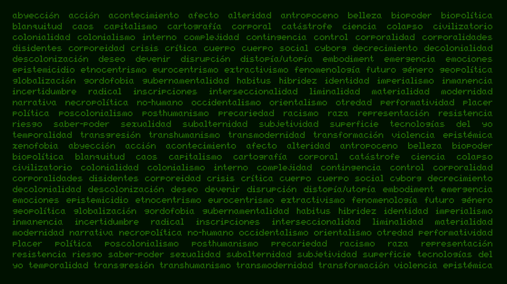

  
**Instrumentos de Navegación #1: Cuerpo, Colonialidad y Crisis.**

Instrumentos de Navegación (IdN) tiene como objetivo ser un espacio de co-aprendizaje y reflexión persistente basado en cursos/seminarios organizados en torno a conceptos “clave” del pensamiento contemporáneo y sus diferentes manifestaciones en las artes visuales contemporáneas.

En la primera edición abordaremos los conceptos (1) Cuerpo, (2) Colonialidad y (3) Crisis a partir de lecturas, teorías y prácticas artísticas contemporáneas. En tres sesiones, una por concepto, buscaremos identificar y problematizar cada uno, de manera introductoria, a partir de sus genealogías y los enfoques teóricos que los han abordado; con énfasis en la historia cultural, teoría crítica y la perspectiva antropológica contemporánea. 

Luego de una presentación conceptual, exploraremos casos de proyectos y artistas que abordan el cuerpo, la colonialidad y la crisis para conocer estrategias materiales de reflexión y representación en el campo artístico global. A su vez, los conceptos nos llevarán a tejer relaciones con conceptos afines y sus ensamblajes con fenómenos como la idea de la construcción social de la realidad, la división mente/cuerpo, el cuerpo sexuado, la colonialidad del saber, violencia epistémica, luchas y conflicto decolonial, colonialidad contemporánea y la crisis como narrativa en su relación con la “crítica” como virtud y mandato social.

El curso/seminario está pensado para cualquier persona interesada en estos temas y no es necesario tener ningún conocimiento previo, salvo apertura de mente y un interés por discutir sentidos comunes. Serán sesiones dirigidas, estructuradas a partir de una presentación conceptual introductoria, algunos casos de estudio y un espacio para la discusión e intercambio entre todxs.

Las sesiones serán a distancia, vía Zoom, y aunque se espera y promueve la sincronicidad, al día siguiente de cada sesión compartiremos la grabación por una semana para su visionado asincrónico.

El curso es gestionado y conducido por Carlos Zevallos Trigoso, magíster en Antropología Visual, comunicador, fotógrafo y docente en la Pontificia Universidad Católica del Perú.  

Duración: tres sesiones de 7:00pm  a 9:30pm.  
Fechas: miércoles 6, 13 y 20 de noviembre  
Costo: S/. 150 (Pago vía Yape, Plin o Transferencia)

Vía: Zoom

Para inscribirse solo deben enviar un correo a info@rizoma.pe

Algunas consideraciones

Por las características del curso este iniciará con un mínimo de 8 participantes y un máximo de 25\. Cualquier información sobre el inicio del curso se anunciará con la debida anticipación.

