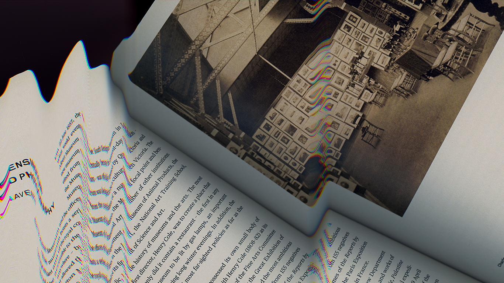

# **Poder-Curar: incursiones en la curaduría desde sus conceptos, discursos y prácticas (2024)**
  
En los últimos años, el término ‘curaduría’ ha ganado gran prominencia en el ámbito del arte contemporáneo, tanto a nivel internacional como local. A tal punto que se ha vuelto mandatorio para comprender y participar en ciertos eventos artísticos de relevancia. Sin embargo, este aumento en su uso ha llevado a cierto escepticismo: ¿Qué representa realmente la curaduría? ¿Es una disciplina, un rol, una profesión? Aunque existen varias respuestas, persisten las dudas. La necesidad de un curador para una exhibición de arte contemporáneo es debatida; algunos la consideran vital, otros una exigencia del mercado. Lo cierto es que el concepto de curaduría está rodeado de debates que merecen ser analizados y entendidos, ya sea para su práctica o para problematizar.

El curso-taller ‘poder-curar’ se propone como un espacio para explorar y reconocer estos debates. Pretende abordar la curaduría desde su dimensión discursiva, identificando sus lógicas y métodos. A lo largo de seis sesiones, divididas en dos teóricas y cuatro teórico-prácticas, examinaremos la transformación del concepto ‘curaduría’ en el arte contemporáneo y abordaremos conceptos y procesos clave en su quehacer. Cada participante tendrá la oportunidad de presentar y discutir un proyecto de curaduría propio, con el objetivo de mejorarlo y someterlo a crítica.

Este curso-taller está diseñado no solo para aquellos interesados en ejercer la curaduría, sino también para artistas y otras personas que deseen comprender o involucrarse en sus dinámicas. Esto incluye preparar presentaciones de obras a postulaciones y proyectos. En resumen, el taller busca ofrecer un entendimiento más profundo y crítico de la curaduría en el arte contemporáneo con énfasis en la adquisición de competencias prácticas para crear y lidiar mejor con el campo del arte local y sus exigencias.

Poder-Curar, entonces, es un juego de palabras que evoca el cruce entre la curaduría como poder y la curaduría como quehacer. Dos dimensiones que esperamos abordar en el curso-taller.

**Objetivos del curso-taller:**

* Explorar las lógicas de lo curatorial y conocer cómo se ha formado la figura del «curador/curadora» en el campo del arte contemporáneo.  
* Adquirir conocimientos esenciales sobre los conceptos clave de la curaduría, abarcando tanto su base teórica como su aplicación práctica.  
* Presentar y discutir proyectos propios, relacionados con la curaduría o cualquier otra faceta del arte, para recibir retroalimentación constructiva del grupo y del profesor, con el objetivo de mejorar y validar estas iniciativas.

**Modalidad:**

El curso será presencial y será en seis sesiones de dos horas y media. Es recomendable pero no obligatorio contar con un proyecto curatorial (puede ser una idea muy básica) para las sesiones de discusión; también pueden participar con otro tipo de proyectos: obras, postulaciones, etc.

**Costo:** S/. 300 

**Fechas:** los jueves del 11 de enero al 15 de febrero del 2024

**Hora:** de 7:00 a 9:30pm

**Lugar:** Miraflores (presencial).  
**Inscripciones y consultas a través de los correos electrónicos:**info@rizoma.pe o czevallost@rizoma.pe

**Profesor**

**Carlos Zevallos Trigoso** es Magíster en Antropología Visual y Comunicador formado en la Pontificia Universidad Católica del Perú, donde es docente en la Facultad de Comunicaciones, en la Facultad de Arte y Diseño y en la Maestría en Antropología Visual. Además se desempeña como investigador en temas de arte contemporáneo y curador independiente. Sus principales temas de investigación son la fotografía como tecnología de representación, el desarrollo del arte contemporáneo local y su relación con las economías políticas neoliberales y las prácticas artísticas ante el mandato contemporáneo de lo crítico. Como curador ha organizado exposiciones individuales y colectivas en instituciones como el ICPNA, la Galería El Ojo Ajeno, la Alianza Francesa y la Casa O’Higgins. 

Además es miembro activo en el Grupo de Investigación en Antropología Visual de la PUCP donde actualmente explora las posibilidades del enfoque colaborativo en la práctica curatorial.

