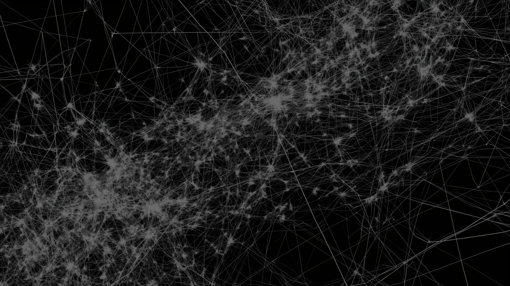

  
# Curso corto: creación de portafolio de artista y escritura de statement (2024)

# Sumilla:

El portafolio es un documento clave para lxs artistas, donde se presenta de forma sistemática la relación entre su carrera, su producción artística (obras/proyectos), y los temas y medios que definen su perfil profesional. Este documento se elabora con el fin de ser compartido en diversas plataformas, proporcionando al lector una visión global de la práctica artística del creador o creadora y su enfoque particular. Es comúnmente utilizado para aplicar a concursos, residencias o programas académicos, y también es de interés para galeristas y coleccionistas. Adicionalmente, el portafolio puede incluir un ‘statement’ o declaración, que articula de manera escrita los intereses de investigación y conceptuales del artista, enmarcados dentro del contexto del arte contemporáneo.

En este curso corto (dos sesiones de dos horas) abordaremos algunas estrategias y criterios para planificar, organizar y crear un portafolio de artista pensando en su funcionalidad y revisaremos puntos clave que podemos tomar en cuenta para la redacción de un “statement”.

El curso será vía zoom en dos sesiones de dos horas y media (la última media hora es para resolver inquietudes)

Fechas y horario: 29 de febrero y 7 de marzo, de 7:00 a 9:30pm vía Zoom.

# Costo\*: S/. 100 

\* 20% de descuento si ya llevaste antes un curso con Rizoma.pe o si te inscribes junto a otra persona (el descuento es para ambxs).

Consultas e inscripciones por DM rizoma.pe o por correo a info@rizoma.pe

# Profesor

Carlos Zevallos Trigoso es Magíster en Antropología Visual y Comunicador formado en la Pontificia Universidad Católica del Perú, donde es docente en la Facultad de Comunicaciones, en la Facultad de Arte y Diseño y en la Maestría en Antropología Visual. Además se desempeña como investigador en temas de arte contemporáneo y curador independiente. Sus principales temas de investigación son la fotografía como tecnología de representación, el desarrollo del arte contemporáneo local y su relación con las economías políticas neoliberales y las prácticas artísticas ante el mandato contemporáneo de lo crítico. Como curador ha organizado exposiciones individuales y colectivas en instituciones como el ICPNA, la Galería El Ojo Ajeno, la Alianza Francesa y la Casa O’Higgins. 

Además es miembro activo en el Grupo de Investigación en Antropología Visual de la PUCP donde actualmente explora las posibilidades del enfoque colaborativo en la práctica curatorial.

