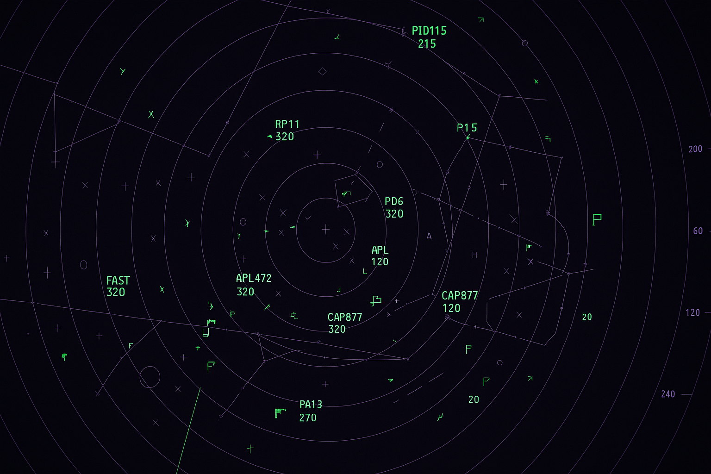

**Fechas:** jueves 12, 19 y 26 de junio.  
**Horario:** 7:00 a 10:00pm

**Vía Zoom**

**Costo:** S/. 180

## Instrumentos de Navegación 3_ poder, tecnología e inteligencia artificial (2022)

**Instrumentos de Navegación (IdN)** es una serie de cursos/seminarios cortos donde abordamos conceptos fundamentales de la historia de las ideas en articulación con experiencias del arte contemporáneo. Las sesiones se desarrollan en modalidad online (vía Zoom), dirigidas a cualquier persona interesada en explorar las intersecciones entre elaboraciones teóricas y manifestaciones culturales contemporáneas.

Desarrollaremos sesiones de **tres horas, de 7:00 a 10:00pm**, incluyendo un receso de 15 minutos, con espacios de discusión colectiva a partir del análisis de casos específicos.

Los conceptos seleccionados para la tercera edición son **poder, tecnología e inteligencia artificial**. Cada uno será abordado desde una perspectiva genealógica que examina las condiciones históricas que permitieron su emergencia y transformación, prestando atención a discontinuidades y rupturas.

La estructura metodológica articula tres momentos: examinaremos las condiciones históricas de emergencia de cada concepto, nos adentraremos en enfoques contemporáneos que los han reconfigurado significativamente, y desarrollaremos análisis aplicados a manifestaciones en culturas visuales y prácticas artísticas contemporáneas.

El **poder** será explorado desde la tensión entre concepciones que lo comprenden como sustancia poseíble o capacidad de imposición vertical, y la reconceptualización de Michel Foucault que lo entiende como modalidad específica de relación social. Esta perspectiva foucaultiana reconceptualiza el poder no como entidad que algunos poseen, sino como campo relacional de fuerzas que circulan produciendo efectos de verdad, configuraciones de saber y procesos de subjetivación.

La **tecnología** se abordará reconociendo que las relaciones entre tecnología y sociedad no pueden comprenderse mediante modelos causales unidireccionales. Examinaremos enfoques que comprenden esta relación como fundamentalmente co-constitutiva, donde configuraciones técnicas específicas y formaciones sociales particulares se constituyen mutuamente a través de mediaciones complejas.

La **inteligencia artificial** será tratada como materialización histórica específica de aspiraciones orientadas hacia la automatización de procesos cognitivos. Examinaremos cómo el anhelo por automatizar la inteligencia se materializa en el siglo XX a través de la confluencia entre cibernética, computación digital y ciencias cognitivas, prestando particular atención a la transición desde enfoques simbólicos hacia aproximaciones sub-simbólicas fundamentadas en aprendizaje maquínico y modelos generativos contemporáneos que problematizan distinciones entre producción humana y automatizada, creatividad y procesamiento algorítmico.

Cada concepto será contextualizado mediante casos de estudio de artes visuales contemporáneas que operen como dispositivos analíticos capaces de problematizar críticamente estas transformaciones conceptuales, revelando tensiones y posibilidades no inmediatamente visibles en los marcos teóricos considerados.

El curso es conducido por **Carlos Zevallos Trigoso** ([@ca.zt](https://www.instagram.com/ca.zt/)), Magíster en Antropología Visual, curador independiente y docente en la Pontificia Universidad Católica del Perú.

Inscripciones a través del correo info@rizoma.pe o un DM a [@rizoma.pe](https://www.instagram.com/rizoma.pe/)

**Algunas consideraciones**

Por las características del curso este iniciará con un mínimo de 8 participantes y un máximo de 25\. Cualquier información sobre el inicio del curso se anunciará con la debida anticipación.

