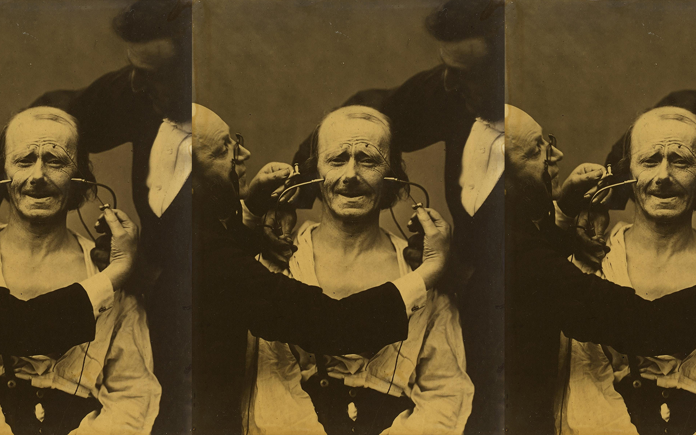

**Fechas:** jueves 7, 14 y 21 de agosto.  
**Horario:** 7:00 a 10:00pm

**Vía Zoom**

**Costo:** S/. 180

## Imágenes que atraviesan: análisis de las imágenes desde la semiótica de C.S. Peirce

Charles Sanders Peirce (1839-1914) fue un científico, filósofo y lógico de origen estadounidense, considerado fundador del pragmatismo y precursor de la semiótica moderna. Su principal aporte consistió en el desarrollo de una teoría triádica del signo que se anticipó históricamente a la influyente semiología diádica que Ferdinand de Saussure desarrollaría posteriormente. La innovación peirceana radica en haber incorporado sistemáticamente el concepto de «interpretante» como tercer elemento constitutivo del proceso semiótico, trascendiendo así los modelos relacionales simples entre signo y referente. 

Esta arquitectura triádica no se limita a integrar procesos de recepción, sino que conceptualiza la significación como un proceso dinámico donde el interpretante constituye el efecto del signo capaz de generar nuevos procesos semióticos. Esta aproximación permite concebir al signo (incluidas las imágenes) no únicamente como vehículo que representa o porta significados preestablecidos, sino como mediador activo que opera en la constitución misma de la experiencia.

En este curso nos aproximaremos a los aportes de Peirce, identificando los conceptos clave dentro de su teoría que nos permitan enriquecer nuestras experiencias de análisis de las imágenes; enfocándonos en la forma en que estas participan de complejos procesos de iconización (cuando los signos establecen relaciones de semejanza), indexación (cuando los signos señalan algo concreto) y simbolización (cuando los signos remiten a procesos sociales y convenciones sobre el significado). Esto, a su vez, asociado a una muy heterogénea caja de herramientas conceptuales que permiten pensar en las imágenes como fenómenos que afirman, evocan, argumentan, etc. 

Veremos también cómo el modelo Peirceano ha estado presente en el desarrollo de diferentes aproximaciones al significado a través del trabajo de autores muy diversos como Roman Jacobson, Umberto Eco, entre otrxs y también el rol que tuvo en el desarrollo de la llamada Antropología Semiótica.

El curso tiene un costo de S/. 180 por las tres sesiones de tres horas. 

En cada sesión tendremos una primera parte de presentación de conceptos y ejemplos, un break de quince minutos y luego una segunda parte de diálogo y análisis a partir de casos propuestos por el docente o lxs inscritxs.

Para participar en el curso no es necesario tener ninguna experiencia ni formación previa en análisis de las imágenes.

El curso es conducido por **Carlos Zevallos Trigoso** ([@ca.zt](https://www.instagram.com/ca.zt/)), Magíster en Antropología Visual, curador independiente y docente en la Pontificia Universidad Católica del Perú.

Inscripciones a través del correo info@rizoma.pe o un DM a [@rizoma.pe](https://www.instagram.com/rizoma.pe/)

**Algunas consideraciones**

Por las características del curso este iniciará con un mínimo de 8 participantes y un máximo de 25\. Cualquier información sobre el inicio del curso se anunciará con la debida anticipación.

